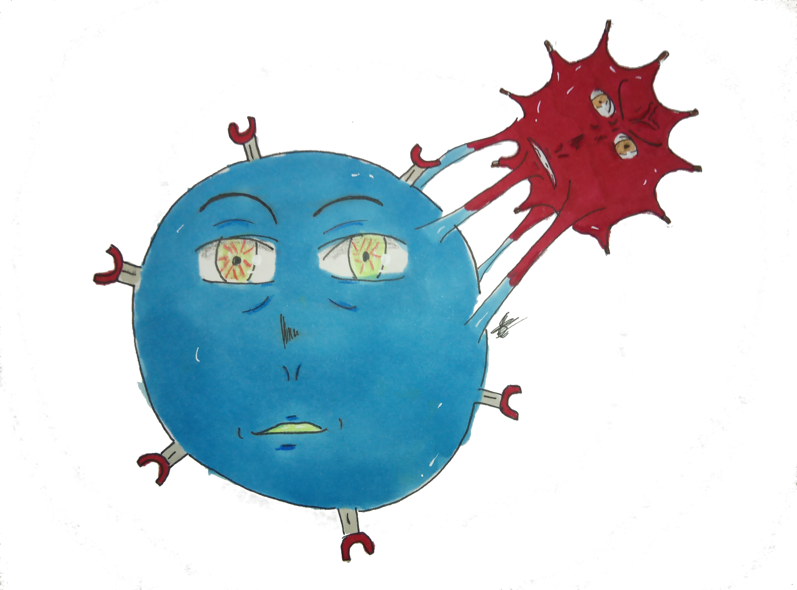

# CAR T Boolean model

This model is an adaptation from Shah et al. https://pubmed.ncbi.nlm.nih.gov/36798455/ 

It has been updated and modified to answer specific questions addressed by the project.

